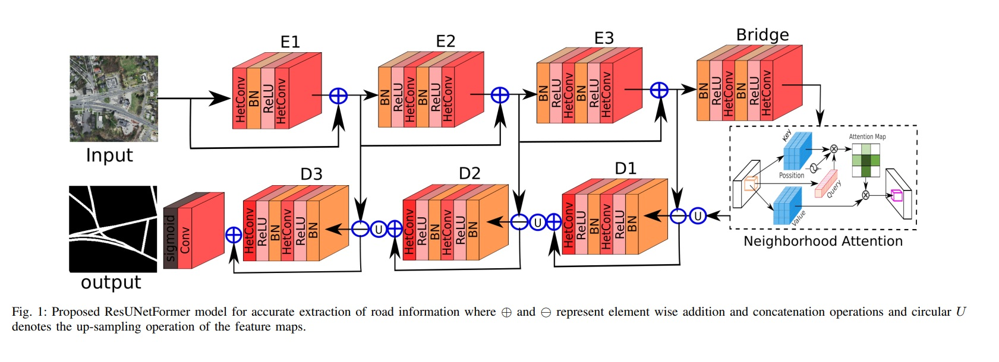

# Neighborhood Attention Makes the Encoder of ResUNet Stronger for Accurate Road Extraction

[Ali Jamali](https://www.researchgate.net/profile/Ali-Jamali), [Swalpa Kumar Roy](https://swalpa.github.io), [Jonathan Li](https://uwaterloo.ca/geography-environmental-management/people-profiles/jonathan-li), and [Pedram Ghamisi](https://www.iarai.ac.at/people/pedramghamisi/)

___________

This Keras code is for the paper A. Jamali, S. K. Roy, J. Li and P. Ghamisi, "[Neighborhood Attention Makes the Encoder of ResUNet Stronger for Accurate Road Extraction]," in IEEE Geoscience and Remote Sensing Letters, doi: 10.1109/LGRS.2024.3354560 [https://ieeexplore.ieee.org/document/10400502].

Citation
---------------------

**Please kindly cite the paper if this code is useful and helpful for your research.**

      @article{10400502,
              title={Neighborhood Attention Makes the Encoder of ResUNet Stronger for Accurate Road Extraction},
              author={Jamali, Ali and Roy, Swalpa Kumar and Li, Jonathan and Ghamisi, Pedram},
              journal={IEEE Geoscience and Remote Sensing Letters}, 
              year={2024},
              volume={},
              number={},
              pages={1-1},
              doi={10.1109/LGRS.2024.3354560}
              }

Acknowledgement
---------------------

Part of the local window attention (LWA) block is implementated from [Neighborhood Attention Transformer](https://github.com/SHI-Labs/Neighborhood-Attention-Transformer). 

## License

Copyright (c) 2023 Ali Jamali. Released under the MIT License. See [LICENSE](LICENSE) for details.
